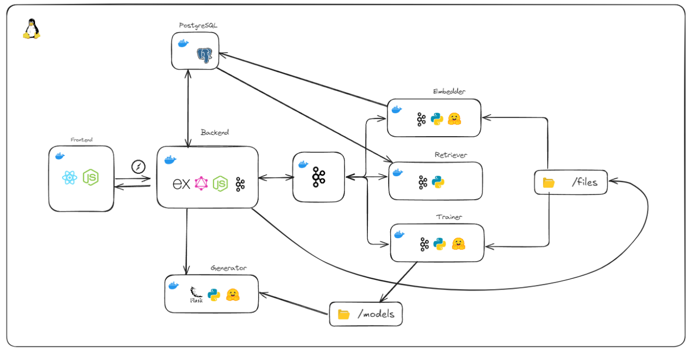

## About Me 😊

Hey there! I'm a passionate 23-year-old backend developer currently working at **Telefónica**. My focus is on **system design and architecture**, with a strong interest in building scalable, robust **microservices** and **distributed systems**. I enjoy tackling complex challenges that require innovative architectural solutions. In addition, I'm deeply fascinated by artificial intelligence, particularly in areas such as **intelligent agents** and **large language models** (LLMs). I'm always exploring new technologies and ideas to push the boundaries of what's possible in the **backend** world.

## Stack 📚

  <h4>FrontEnd</h4>
  

  <h4>BackEnd</h4>
  

  <h4>SQL Databases</h4>
  

    
    <h4>NoSQL Databases</h4>
    
    
  

  <h4>Queues & Communication</h4>
  

    
    
    
  

  <h4>CD/CI</h4>
  

## Personal Projects 🚀

### TuneYourLlama 🦙🦙  

TuneYourLlama es una plataforma para el fine-tuning de LLMs con datos privados, combinando **ajuste de modelos** y **RAG (Retrieval-Augmented Generation)** para respuestas más precisas.  

#### 🚀 Características  
- **Fine-tuning** de modelos de Hugging Face con datos propios (PDF, CSV).
- **RAG** para mejorar respuestas mediante embeddings y bases de datos vectoriales.  
- **Procesamiento en tiempo real** con Kafka y colas de eventos.  
- **Arquitectura distribuida** con microservicios, PostgreSQL y seguridad integrada.  
- **Interfaz interactiva** en React para monitorear y gestionar el entrenamiento.  

#### 📷 Arquitectura

 
## Statistics 📈 

 

## Contact Me ✉

